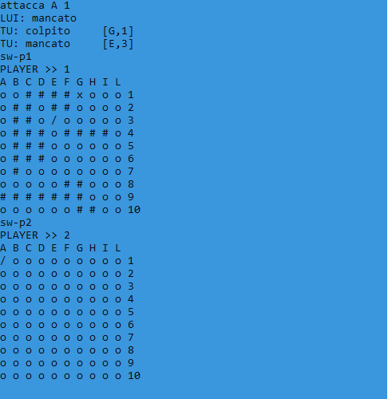
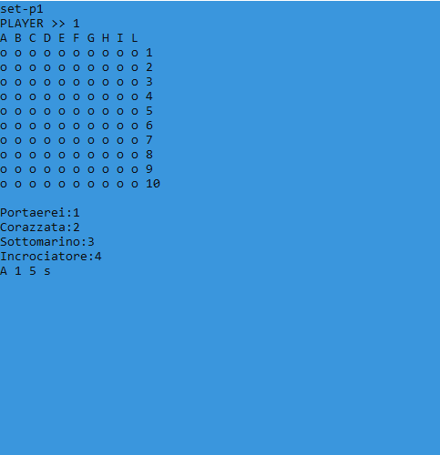

# Battleship
**Commands**:
* **[sw-p1]** : view player 1(you) table.
* **[sw-p2]** : view player 2(computer) table.
* **[gen-p1]** : generates a random position for player 1.
* **[gen-p1]** : generates a random position for player 2.
* **[set-p1]** : the sequence of positioning of the ships begins
  * **positioning** : [column]  [row]  [dimension]  [direction]
    * **column** : A,B,C,D,E,F,G,H,I,L
    * **row**: 1,2,3,4,5,6,7,8,9,10
    * **dimension**: 2 (Incrociatore), 3 (sottomarino), 4 (corazzata), 5 (portaerei)
    * **direction**: e (east/right), o (west/left), n (nord/up), s (sud/down)
  * **example** :     [A]  [1]  [4]  [e]
* **[reset-p1]** : reset player 1 position.
* **[reset-p2]** : reset player 2 position.
* **[reset-all]** : reset all player position position.
* **[cls]** : clear screen.
* **[help]** : to see a list of commands.
* **[start]** : start the game:
  * **attack** : [attacca]  [column]  [row]
  * **example**:  [attacca]  [A]  [1] 
  * *once you hit your opponent you have to keep attacking.
* **[stop]** : exit to the game.

**Example Image**:

 

 

